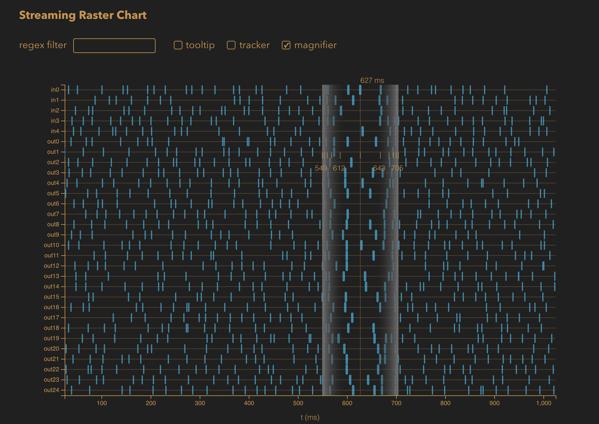

# stream-charts

Please see [change history](changes.md) for a history of changes.

These charts are currently still under development. Soon these charts will be available as a npm module.

## intro

Charts for viewing high frequency data in real-time. The charts below show charts after the data has been streamed.

The first chart is a neuron raster chart that displays neuron spikes as a function of time. In the image below, a magnifier lens is used to enlarge a region of the data to compare spikes from different neurons.



In this image, the weights are plotted as a function of time, and the tooltip shows the weight updates that came just before the mouse cursor and just after, as well as the time and weight changes.

  

In both cases the plots were updated in real-time with an average update time interval of 25 ms. 

## usage

The [examples](src/app/examples) directory has examples. The [`StreamingRasterChart`](src/app/examples/StreamingRasterChart.tsx) provides an example of using the raster chart. The [`StreamingScatterChart`](src/app/examples/StreamingScatterChart.tsx) provides an example of using the scatter chart. Both of these examples provide controls for enabling the tooltip, tracker, and magnifier enhancements.

## running examples

Install the dependencies.

```shell script
$ npm install
```

Run the development server, which should fire up a browser and load the example app.
```shell script
$ npm start
```

##

This project was bootstrapped with [Create React App](https://github.com/facebook/create-react-app).